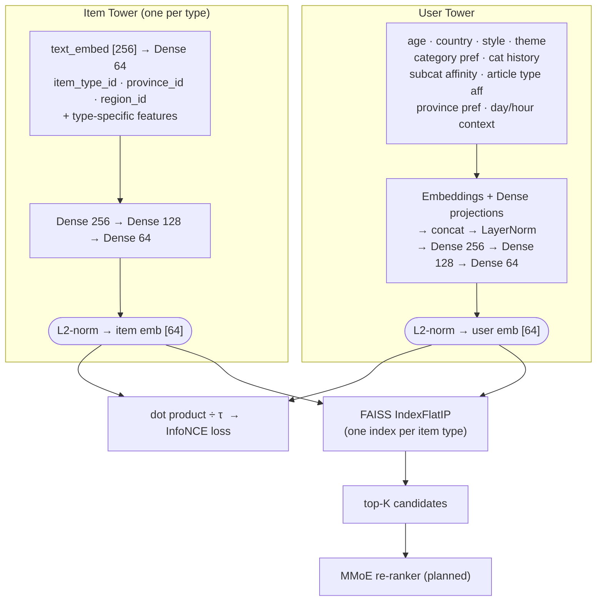

# Travel Recommendation System

Two-tower retrieval model สำหรับแนะนำสถานที่ท่องเที่ยวไทย  
Built with TensorFlow/Keras + FAISS.

## Architecture



Trained jointly across 4 item types (attraction, accommodation, event, article) with InfoNCE + mixed negatives. See [`docs/experiments.md`](docs/experiments.md) for full architecture details and experiment history.

## Project Structure

```
travel-recsys/
├── configs/
│   └── config.yaml              # hyperparameters, vocab sizes, behavior config
├── data/
│   ├── raw/                     # source parquets (not committed)
│   ├── processed/               # pre-computed text embeddings (not committed)
│   └── generated/               # synthetic interactions (not committed)
├── docs/
│   └── experiments.md           # architecture reference + experiment log
├── scripts/
│   ├── embed_items.py           # pre-compute Gemma MRL embeddings (256-dim)
│   ├── generate_behavior.py     # persona-based interaction simulation
│   ├── train.py                 # end-to-end training entry point
│   └── evaluate.py              # offline Hit@K / NDCG@K evaluation
├── src/
│   ├── data/
│   │   ├── schema.py            # feature schemas, vocab registries
│   │   ├── preprocessing.py     # normalizers, encoders, per-type feature extractors
│   │   └── behavior_generator.py
│   ├── models/
│   │   ├── user_tower.py
│   │   ├── item_towers.py       # BaseItemTower + 4 type-specific towers
│   │   └── two_tower.py         # TwoTowerModel, joint loss
│   ├── training/
│   │   ├── losses.py            # infonce_loss, mixed_negative_loss
│   │   ├── dataset.py           # StratifiedInteractionDataset
│   │   └── trainer.py           # TwoTowerTrainer + WarmupCosineDecay schedule
│   └── serving/
│       └── retrieval.py         # MultiTypeIndex, RetrievalPipeline
└── pyproject.toml
```

## Setup

### Prerequisites

- [uv](https://docs.astral.sh/uv/getting-started/installation/) ≥ 0.6
- Python 3.12 (managed automatically by uv via `.python-version`)

Install uv (macOS / Linux):

```bash
curl -LsSf https://astral.sh/uv/install.sh | sh
```

### Install dependencies

```bash
uv sync
```

This creates `.venv/`, pins Python 3.12, and installs all dependencies from `uv.lock`.

To include dev extras (Jupyter, matplotlib, seaborn):

```bash
uv sync --group dev
```

### Activate the environment (optional)

Most commands use `uv run` and don't require activation, but if you prefer:

```bash
source .venv/bin/activate
```

> **macOS note:** `tensorflow-metal` is not installed — it is incompatible with TensorFlow 2.20. Training runs on CPU, which is sufficient for the current dataset size.

## Data

| Source dir        | Item type     | Rows   |
|-------------------|---------------|--------|
| `destinations/`   | Attraction    | 8,632  |
| `activities/`     | Event         | 21,376 |
| `accommodations/` | Accommodation | 2,972  |
| `articles/`       | Article       | 1,559  |
| `user_profiles/`  | Users         | 1,000  |

No real interaction data — training uses **persona-based synthetic interactions** (5 personas: backpacker, family, culture_seeker, foodie, luxury).

## Run

### Step 1 — Pre-compute text embeddings

```bash
HF_TOKEN=hf_... uv run python scripts/embed_items.py
```

Encodes `text_for_embed` fields using Gemma embedding with MRL, truncated to 256-dim.  
Saves `data/processed/{type}_text_embeds.npy` and `{type}_item_ids.npy`.

### Step 2 — Generate synthetic interactions

```bash
uv run python scripts/generate_behavior.py
```

Default: 1,000 users, 30–100 interactions each. To scale up:

```bash
uv run python scripts/generate_behavior.py --augment-users 5000 --ipp-max 150
```

Saves `data/generated/interactions.parquet` and `data/generated/user_features.parquet`.

### Step 3 — Train

```bash
uv run python scripts/train.py
```

Reads hyperparameters from `configs/config.yaml`. CLI flags override config values:

```bash
uv run python scripts/train.py --epochs 60 --batch-size 256
```

Saves towers to `models/towers/` and FAISS index to `models/index/`.

### Step 4 — Evaluate

```bash
uv run python scripts/evaluate.py
```

Reports Hit@K and NDCG@K overall and per item type against a held-out chronological val split.

```bash
uv run python scripts/evaluate.py --top-k 10 20 50 100 --max-eval 10000
```

## Serving

```python
from src.serving.retrieval import MultiTypeIndex, RetrievalPipeline

pipeline = RetrievalPipeline(model, multi_index)
pipeline.index.load("models/index")

# Retrieve top-100 items for a user
results = pipeline.retrieve(user_inputs, top_k_total=100)
# results: List[RetrievalResult(item_id, item_type, score)]
```

## Experiments

See [`docs/experiments.md`](docs/experiments.md) for the full experiment log, including architecture details, per-run hyperparameters, and results tables.

Latest results (Exp-002, 5k users, cosine LR decay):

| | Hit@10 | Hit@50 | Hit@100 |
|---|---|---|---|
| Overall | 0.071 | 0.188 | 0.281 |
| Attraction | 0.033 | 0.139 | 0.236 |
| Accommodation | 0.178 | 0.314 | 0.405 |
| Event | 0.077 | 0.217 | 0.318 |
| Article | 0.019 | 0.101 | 0.171 |
