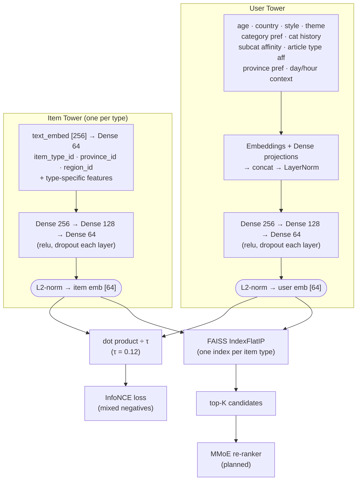

# Model Architecture

## Overview

Two-tower retrieval model with a unified 64-dim embedding space shared across all item types. Retrieval is done with FAISS ANN search per item type; ranking (MMoE) is a planned future stage.



## User Tower

| Feature | Shape | Encoding |
|---|---|---|
| `age_norm` | scalar | z-score |
| `home_country_id` | int | Embedding(7, 8) |
| `travel_style_indices` | int[] (pad -1) | Embedding(5, 8) → masked mean-pool |
| `travel_theme_indices` | int[] (pad -1) | Embedding(15, 8) → masked mean-pool |
| `category_pref_indices` | int[] (pad -1) | Embedding(69, 16) → masked mean-pool |
| `category_interaction_history` | float[69] | Dense(32, relu) |
| `subcat_affinity` | float[58] | Dense(32, relu) |
| `article_type_affinity` | float[12] | Dense(16, relu) |
| `province_pref_indices` | int[] (pad -1) | Embedding(77, 8) → masked mean-pool |
| `context_day_sin/cos` | float × 2 | cyclical day-of-week |
| `context_hour_sin/cos` | float × 2 | cyclical hour-of-day |

MLP head: `concat → LayerNorm → Dense(256, relu) → Dropout → Dense(128, relu) → Dropout → Dense(64) → L2-norm`

## Item Towers

All towers share the same base features and MLP head:

**Shared base** (concatenated before MLP):
- `text_embed [256]` → `Dense(64)` (trainable text projection; pre-computed via Vertex AI `text-embedding-004`, MRL 256-dim)
- `item_type_id` → `Embedding(6, 8)`
- `province_id` → `Embedding(77, 16)`
- `region_id` → `Embedding(5, 8)`

**MLP head** (shared across all types): `Dense(256, relu) → Dropout → Dense(128, relu) → Dropout → Dense(64) → L2-norm`

**Type-specific features** (concatenated with base before MLP):

| Tower | Extra features |
|---|---|
| **Attraction** | `sub_category_indices` → Emb(58,16) pool; `days_open_vector` [7]; `is_free` [1]; `log_view_count` [1] |
| **Accommodation** | `amenity_indices` → Emb(24,8) pool; `price_tier_id` → Emb(6,8); `is_price_missing` [1]; `star_rating_norm` [1]; `log_view_count` [1] |
| **Event** | `category_indices` → Emb(11,8) pool; `duration_days_norm` [1]; `month_sin/cos` [2] |
| **Article** | `article_type_id` → Emb(12,8); `pub_month_sin/cos` [2]; `is_thai` [1]; `pub_recency_norm` [1] |

## Training Objective

InfoNCE (in-batch contrastive) loss with mixed negatives:

```
loss = -log( exp(u·i / τ) / Σ_j exp(u·j / τ) )
```

Negative mix per batch:
- **50%** in-batch same-type negatives
- **25%** random cross-type negatives
- **25%** hard negatives (high-scoring items without positive interaction)

Temperature `τ` = 0.12. Signal weights: view=1.0, click=3.0.

## Vocabulary Sizes

| Vocab | Size |
|---|---|
| Item types | 6 (attraction, restaurant, event, accommodation, shop, article) |
| Provinces | 77 |
| Regions | 5 (N, C, S, E, NE) |
| Attraction subcategories | 58 |
| Event categories | 11 |
| Amenity codes | 24 |
| Price tiers | 6 |
| Travel styles | 5 |
| Travel themes | 15 |
| Home countries | 7 |
| Article types | 12 |
| Item categories | 69 |

## Serving

FAISS `IndexFlatIP` (exact inner product, equivalent to cosine on L2-normalized vectors), one index per item type. At query time:
1. Encode user with context (day/hour) → [64]
2. Query each relevant type's FAISS index → top-K candidates
3. *(planned)* Re-rank with MMoE (engagement vs satisfaction tasks)
