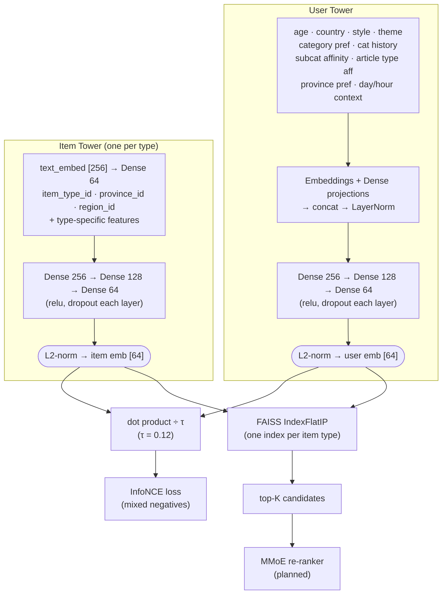

# Experiments

## Model Architecture

### Overview

Two-tower retrieval model with a unified 64-dim embedding space shared across all item types. Retrieval is done with FAISS ANN search per item type; ranking (MMoE) is a planned future stage.



### User Tower

| Feature | Shape | Encoding |
|---|---|---|
| `age_norm` | scalar | z-score |
| `home_country_id` | int | Embedding(7, 8) |
| `travel_style_indices` | int[] (pad -1) | Embedding(5, 8) → masked mean-pool |
| `travel_theme_indices` | int[] (pad -1) | Embedding(15, 8) → masked mean-pool |
| `category_pref_indices` | int[] (pad -1) | Embedding(69, 16) → masked mean-pool |
| `category_interaction_history` | float[69] | Dense(32, relu) |
| `subcat_affinity` | float[58] | Dense(32, relu) |
| `article_type_affinity` | float[12] | Dense(16, relu) |
| `province_pref_indices` | int[] (pad -1) | Embedding(77, 8) → masked mean-pool |
| `context_day_sin/cos` | float × 2 | cyclical day-of-week |
| `context_hour_sin/cos` | float × 2 | cyclical hour-of-day |

MLP head: `concat → LayerNorm → Dense(256, relu) → Dropout → Dense(128, relu) → Dropout → Dense(64) → L2-norm`

### Item Towers

All towers share the same base features and MLP head:

**Shared base** (concatenated before MLP):
- `text_embed [256]` → `Dense(64)` (trainable text projection)
- `item_type_id` → `Embedding(6, 8)`
- `province_id` → `Embedding(77, 16)`
- `region_id` → `Embedding(5, 8)`

**MLP head** (shared across all types): `Dense(256, relu) → Dropout → Dense(128, relu) → Dropout → Dense(64) → L2-norm`

**Type-specific features** (concatenated with base before MLP):

| Tower | Extra features |
|---|---|
| **Attraction** | `sub_category_indices` → Emb(58,16) pool; `days_open_vector` [7]; `is_free` [1]; `log_view_count` [1] |
| **Accommodation** | `amenity_indices` → Emb(24,8) pool; `price_tier_id` → Emb(6,8); `is_price_missing` [1]; `star_rating_norm` [1]; `log_view_count` [1] |
| **Event** | `category_indices` → Emb(11,8) pool; `duration_days_norm` [1]; `month_sin/cos` [2] |
| **Article** | `article_type_id` → Emb(12,8); `pub_month_sin/cos` [2] |

### Training Objective

InfoNCE (in-batch contrastive) loss with mixed negatives:

```
loss = -log( exp(u·i / τ) / Σ_j exp(u·j / τ) )
```

Negative mix per batch:
- **50%** in-batch same-type negatives
- **25%** random cross-type negatives
- **25%** hard negatives (high-scoring items without positive interaction)

Temperature `τ` = 0.12. Signal weights: view=1.0, click=3.0.

### Vocabulary Sizes

| Vocab | Size |
|---|---|
| Item types | 6 (attraction, restaurant, event, accommodation, shop, article) |
| Provinces | 77 |
| Regions | 5 (N, C, S, E, NE) |
| Attraction subcategories | 58 |
| Event categories | 11 |
| Amenity codes | 24 |
| Price tiers | 6 |
| Travel styles | 5 |
| Travel themes | 15 |
| Home countries | 7 |
| Article types | 12 |
| Item categories | 69 |

### Serving

FAISS `IndexFlatIP` (exact inner product, equivalent to cosine on L2-normalized vectors), one index per item type. At query time:
1. Encode user with context (day/hour) → [64]
2. Query each relevant type's FAISS index → top-K candidates
3. *(planned)* Re-rank with MMoE (engagement vs satisfaction tasks)

---

## Exp-001 — Baseline (2026-05-18)

### Setup

| Parameter | Value |
|---|---|
| Users | 1,000 |
| Interactions | 64,666 |
| Epochs | 40 (early stop @ 37) |
| Steps/epoch | 50 |
| Batch size | 512 |
| Temperature | 0.07 |
| LR | 1e-3 (flat) |
| Hard-neg ratio | 0.10 |

### Results

| | @10 | @20 | @50 | @100 |
|---|---|---|---|---|
| **Hit — overall** | 0.073 | 0.103 | 0.169 | 0.250 |
| **NDCG — overall** | 0.036 | 0.043 | 0.056 | 0.069 |
| Hit — attraction | 0.021 | 0.038 | 0.078 | 0.172 |
| Hit — accommodation | 0.149 | 0.183 | 0.266 | 0.351 |
| Hit — event | 0.114 | 0.169 | 0.276 | 0.345 |
| Hit — article | 0.019 | 0.034 | 0.065 | 0.132 |

Val interactions evaluated: 6,466

### Notes

- Accommodation and event perform best — smaller candidate pools and richer structured features.
- Attraction and article are weakest — attraction has many visually similar items (temples, beaches) with weak discriminative signal; article has very sparse interactions.
- The gap between Hit@10 (2%) and Hit@100 (17%) for attraction suggests the model learns coarse signal but cannot rank precisely → MMoE re-ranking would help.
- Val loss plateaued at 5.67 vs train 5.39 → slight overfitting at 50 steps/epoch with only 64k interactions.

---

## Exp-002 — Scale + LR schedule + harder negatives (2026-05-18)

### Changes from Exp-001

| Parameter | Before | After | Reason |
|---|---|---|---|
| Users | 1,000 | 5,000 (augmented) | More coverage |
| Interactions | 64,666 | 450,871 | 7× data |
| `ipp_max` | 100 | 150 | More signal per user |
| `steps_per_epoch` | 50 | 150 | Cover full dataset each epoch |
| `temperature` | 0.07 | 0.12 | Softer targets; 0.07 too aggressive for batch=512 |
| LR schedule | flat 1e-3 | warmup 3 ep → cosine decay to 1e-5 | Better convergence |
| `hard_negative` ratio | 0.10 | 0.25 | Finer discrimination |
| `in_batch_same_type` | 0.60 | 0.50 | Rebalanced to make room |
| `random_cross_type` | 0.30 | 0.25 | Rebalanced to make room |
| Epochs | 40 | 60 (early stop @ 43) | Let cosine decay finish |
| Patience | 10 | 15 | Accommodate slower cosine tail |

Implementation: added `WarmupCosineDecay` schedule class to `src/training/trainer.py`; schedule is built inside `train()` once `epochs` and `steps_per_epoch` are known, so it requires no API change.

### Results

| | @10 | @20 | @50 | @100 |
|---|---|---|---|---|
| **Hit — overall** | 0.071 | 0.111 | 0.188 | 0.281 |
| **NDCG — overall** | 0.036 | 0.046 | 0.061 | 0.076 |
| Hit — attraction | 0.033 | 0.068 | 0.139 | 0.236 |
| Hit — accommodation | 0.178 | 0.226 | 0.314 | 0.405 |
| Hit — event | 0.077 | 0.128 | 0.217 | 0.318 |
| Hit — article | 0.019 | 0.044 | 0.101 | 0.171 |

Val interactions evaluated: 10,000 (sampled from 45,087 available)

### Δ vs Exp-001

| | Hit@10 | Hit@50 | Hit@100 |
|---|---|---|---|
| overall | −0.002 | +0.019 | +0.031 |
| attraction | **+0.012 (+57%)** | **+0.061 (+78%)** | +0.064 |
| accommodation | +0.029 | +0.048 | +0.054 |
| event | −0.037 | −0.059 | −0.027 |
| article | 0.000 | +0.036 | +0.039 |

### Notes

- **Attraction** is the big winner — Hit@50 up 78%. Hard negatives + more data helped the most for items with rich geographic/category features.
- **Accommodation** continues to improve; Hit@100 now 40.5%.
- **Event regression at @10–@50** is the main concern. With 21,376 events and now 12k+ val interactions exposed, the retrieval problem is harder. Root cause: most events have <1 interaction per item in training data — their embeddings are poorly trained. More epochs did not help.
- **Article** flat at @10 but improving at @50/@100; text embeddings contribute to coarse recall but the tower needs more click signal.
- Cosine decay worked as intended — early stop at epoch 43 vs 37 baseline, with smoother val loss descent.

### Open issues

- Event catalog (21,376 items) is too large relative to interaction density (~0.8 interactions/item). Next step: prune events with fewer than N interactions before training, or generate more event-targeted interactions per persona.
- Hit@10 flat overall (0.073 → 0.071) despite gains at @50/@100 — top-1 precision needs hard negatives tuned further or a re-ranking stage.
